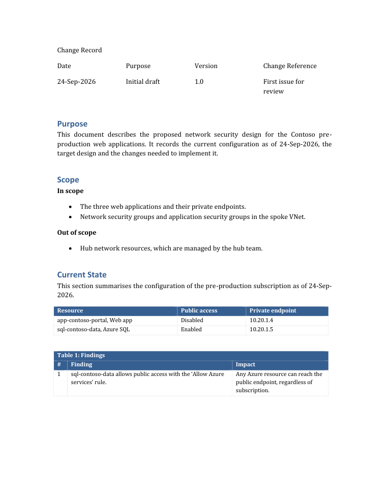

# writing-design-documents

A [Claude Code](https://claude.com/claude-code) skill for producing **client-facing design documents in Word**
(architecture, network security, assessments) on the client's own template, written so they read as prepared by a
consultant rather than generated.



The agent writes the document as a short Python script on top of the client's `.docx` template, lets Word refresh the
table of contents and export a PDF, then runs `check` until nothing is reported. The template keeps its cover, change
record, header, footer, heading numbering and colours; the script only supplies content.

## What's inside

| Path | Purpose |
|---|---|
| `SKILL.md` | When to use the skill, the workflow, how the text should read, and common mistakes |
| `scripts/docbuilder.py` | `DesignDoc` builder (cover text, change record, headings, tables in the template's colours, landscape figure pages), `finalize` (Word: TOC, fields, PDF) and `check` |
| `examples/example_design_doc.py` | Worked example (fictional Contoso): current state, findings, figure page, implementation plan |
| `tests/selftest.py` | Checks the typesetting, that a clean build passes, and that every check rule fires |
| `docs/sample.pdf` | Output of the example on a plain template |

**Check** reports what makes a document look machine-made or reveals how it was produced: em and en dashes, "·" and
"+" separators, straight quotes, bold lead-ins, arrows or semicolons in running text, repeated paragraphs, references
to sections that don't exist, wording about how facts were collected ("read-only", "CLI", "logs show"), common AI
vocabulary, empty pages, table titles separated from their table, and captions separated from their figure.

## Install

```bash
git clone https://github.com/gjohnpaull/writing-design-documents ~/.claude/skills/writing-design-documents
pip install python-docx pymupdf
```

Requirements: Python 3.9+. `finalize` uses Microsoft Word on Windows to refresh the table of contents and export the
PDF; on other systems update the table of contents in Word by hand. Diagrams come from the companion skill
[drawing-architecture-diagrams](https://github.com/gjohnpaull/drawing-architecture-diagrams).

## Use

The skill loads automatically when you ask Claude Code for a design document in Word. Example prompts:

- "Create a network security design document for the web apps in subscription X, using the template
  `Template.docx`, with diagrams from /drawing-architecture-diagrams."
- "Turn these findings into a client assessment document on our template. Don't mention how the data was collected."
- "Update the design document: the private endpoint stays in its current subnet. Keep the change record."

Run the checks yourself at any time:

```bash
python scripts/docbuilder.py finalize Out.docx
python scripts/docbuilder.py check Out.docx --pdf Out.pdf --banned "internal-project-name"
python tests/selftest.py            # DOCB_WORD=1 adds the Word and PDF checks
```

## License

MIT
